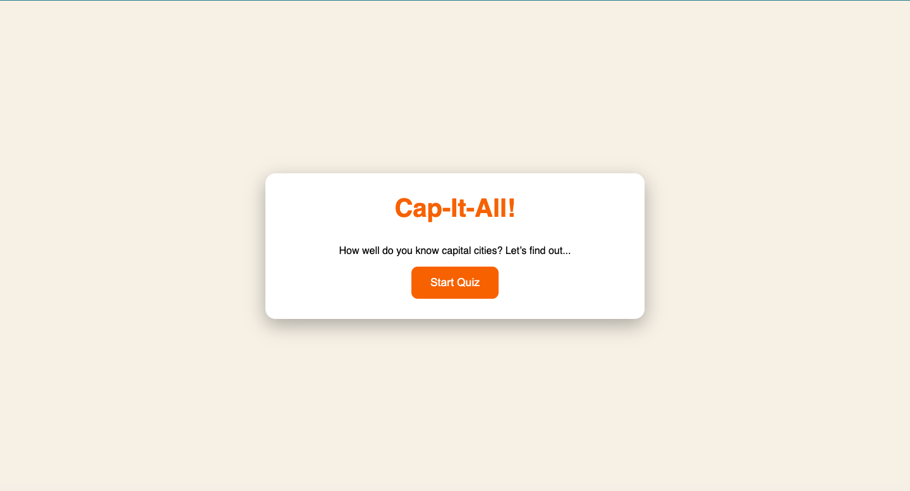

# 🏙 Cap-It-All!

A clean and interactive quiz application designed to test and improve your knowledge of capital cities around the world. This project was built with vanilla HTML, CSS, and JavaScript.

## About The Project

Cap-It-All! is a fun, front-end project created to practice and demonstrate core web development skills. The goal was to build a user-friendly and visually appealing quiz from the ground up, focusing on clean code, DOM manipulation, and a smooth user experience.

The quiz presents users with a series of multiple-choice questions and provides a summary of their performance upon completion.

### Key Features

* **Interactive Quiz:** Engages users with 15 multiple-choice questions.
* **Score Tracking:** Automatically calculates and displays the user's final score.
* **Progress Bar:** Visually indicates how many questions have been answered.
* **Clean & Responsive UI:** A simple and intuitive interface that works well on different screen sizes.
* **Restart Functionality:** Allows users to easily restart the quiz from the results screen to try for a better score.

## Project Preview

The project preview of Cap-It-All! 




## Built With

This project was built using fundamental web technologies:

* HTML5
* CSS3
* Vanilla JavaScript

## Getting Started

To get a local copy up and running, follow these simple steps.

### Prerequisites

You only need a modern web browser to run this project.

### Installation

1.  Clone the repository:
    ```sh
    git clone [https://github.com/P-dilasha-004/cap-it-all.git](https://github.com/P-dilasha-004/cap-it-all.git)
    ```
2.  Navigate to the project directory:
    ```sh
    cd cap-it-all
    ```
3.  Open the `index.html` file in your web browser.

That's it! You can now start the quiz.

## Future Improvements

Here are some ideas for future versions of the project:

* **Use a Public API for Data:** Replace the local question set by fetching data from a free public API like [REST Countries](https://restcountries.com/). This would provide a much larger and more dynamic variety of questions.
* **Implement Difficulty Levels:** Introduce "Easy," "Medium," and "Hard" modes that could introduce a timer for answering or feature less common countries to increase the challenge.

## License

This project is licensed under the MIT License.  
See the [LICENSE](LICENSE) file for details.

## Author

**Dilasha Pant**

* GitHub: [@P-dilasha-004](https://github.com/P-dilasha-004)
